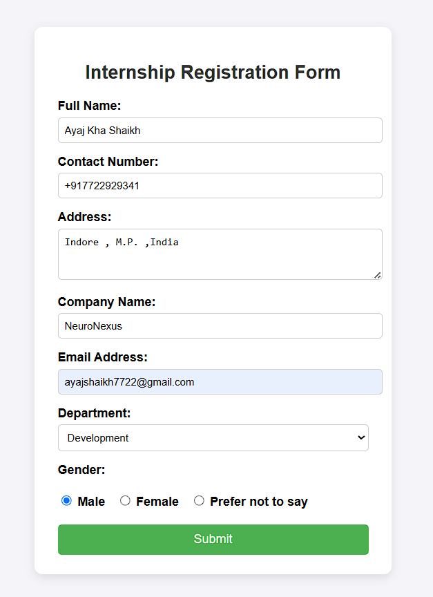

# NeuroNexus

# NeuroNexus Internship – Task 1: Landing Page

## Project Description
This project is part of my web development internship with **NeuroNexus Innovations**. Task 1 required the creation of a **Google Form-style web form** using only HTML and CSS (without any JavaScript).

## Features
- Collects user information:
  - Full Name
  - Contact Number
  - Address
  - Company Name
  - Email Address
  - Department (Dropdown)
  - Gender (Radio Buttons)
- Styled using modern CSS
- Bonus features included:
  - Hover effect on the submit button
  - Distinct form and page backgrounds
  - Minimalistic box-shadow effect for aesthetics

## Live Demo
Click the link below to view the live deployed form via GitHub Pages:  
**[View Live Form](https://mrayaj.github.io/NeuroNexus/)**

## Technologies Used
- HTML5
- CSS3

## Screenshots
 *(Optional: Upload a screenshot of your form and rename it to `screenshot.png`)*

## How to Use
1. Clone the repository:
   ```bash
   git clone https://github.com/mrayaj/NeuroNexus.git
